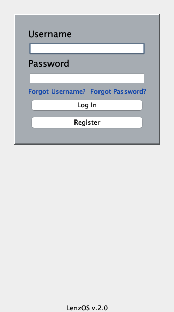
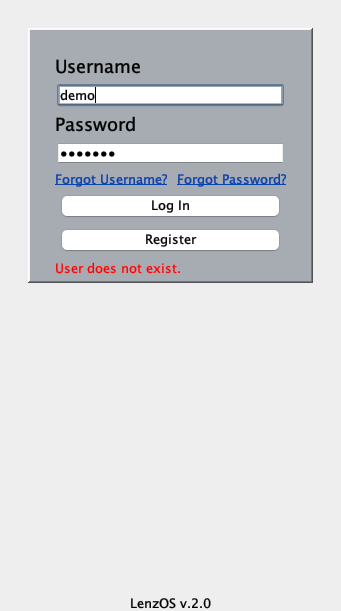
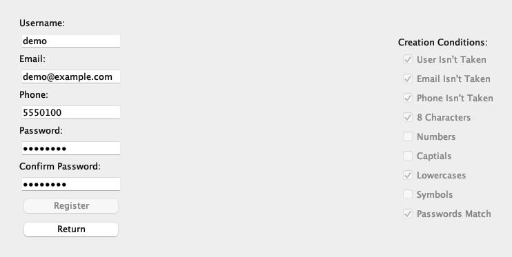
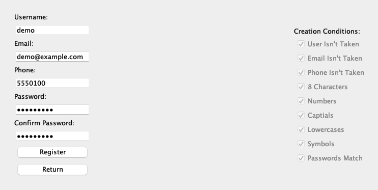
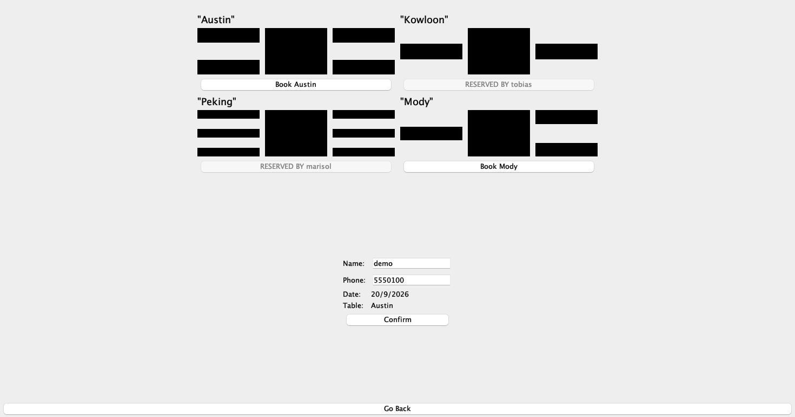
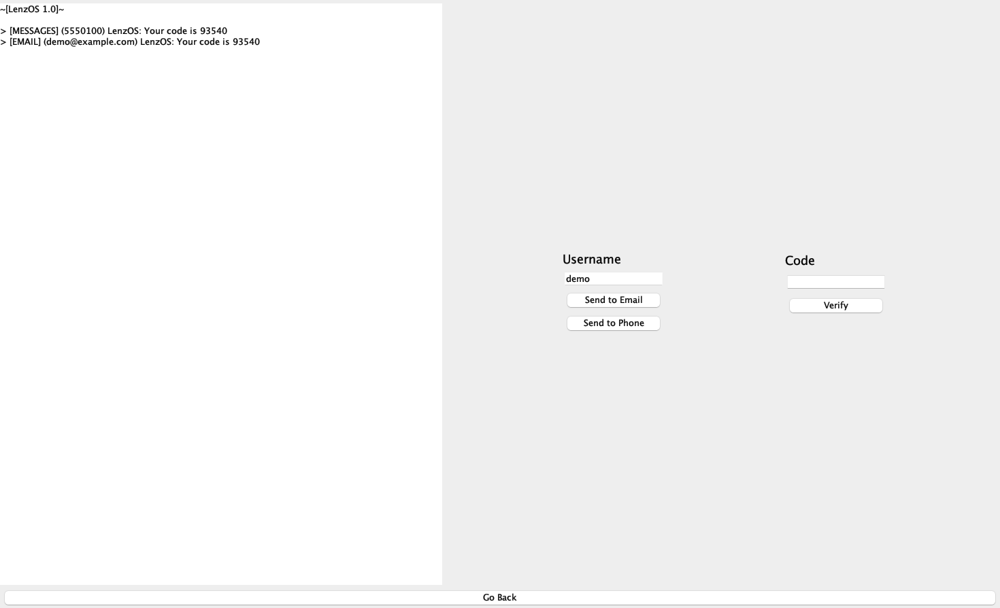

> [!WARNING]
> This is a Java Swing desktop app for booking a private dining room, written in March 2023 as the first performance task for my IB HL computer science class. It got 7/7 and I haven't touched it since. It won't run from a fresh clone: every screen is an IntelliJ GUI Designer `.form` file that only IntelliJ's form compiler knows how to build, the `pom.xml` points at a jar path that exists on no machine, no database schema ships with the repo, and passwords sit in MySQL as plaintext. I've written down how to get it running and what's wrong with it instead of fixing any of it.

<div align="center">


</div>

## About

You register an account, log in, pick a date, and book one of four named private dining rooms. If somebody already took that room on that date, the button for it reads `RESERVED BY <name>` and won't click. It's nine Swing screens laid out in IntelliJ's GUI Designer, sitting on two separate MySQL databases, one holding users and one holding reservations.

The registration screen is the part I'd still defend. Nine conditions get rechecked on every keystroke and the Register button stays disabled until all nine pass, so you can watch the checkboxes fill in as you type. The password reset flow was the other problem worth solving: I had no way to send an SMS or an email, so I faked a phone console that prints the six-digit code into a pane on the same screen.

The rest of it shows its age. The home screen is a header, one button and a sign-out bar. Both database classes carry a `debugPrint()` that `Session` fires on startup, and the user one writes the whole table to stdout, passwords included, under a block-letter ASCII header.

- Registration gated on nine live conditions: username, email and phone not already taken, 8 characters, numbers, capitals, lowercases, symbols, passwords match
- Login that tells the three failure cases apart, so you get `Please fill out all fields.`, `Incorrect password.` or `User does not exist.` rather than one generic refusal
- Forgot Username, which looks you up by either email or phone
- Forgot Password, running through a simulated SMS and email console to a code entry screen and then a password change that enforces the same rules registration does
- Four private dining rooms (Austin, Kowloon, Peking, Mody) drawn as black table-and-seat blocks, each with its own seat count
- Availability checked per room per date, with taken rooms disabled and labeled with whoever booked them
- Typed values carried between screens, so a username typed at Login is already filled in on Register, and your account details prefill the reservation form

## Tech stack

| Layer | Technology | Why it's here |
| --- | --- | --- |
| Language | Java 18 | `pom.xml` sets `maven.compiler.source` and `target` to 18. It compiles clean on newer JDKs too. I ran it on OpenJDK 26.0.1. |
| UI toolkit | Swing | Every screen is a `JPanel` swapped into one `JFrame` by `Session.setActivePanel()`. No tabs, no dialogs, no window management. |
| UI layout | IntelliJ GUI Designer | Nine `.form` XML files hold the layout. IntelliJ generates the `$$$setupUI$$$` method that builds the components, which is why this needs the IDE rather than a plain compiler. |
| Database | MySQL 8 via `mysql-connector-j` 8.0.32 | Two schemas, `loginsystem` and `reservationsystem`. Every query is a `PreparedStatement` except the two `SELECT *` reads. |
| Date picker | JCalendar 1.4 (`com.toedter.calendar.JDateChooser`) | The one third-party widget, wired up in `Reservation.createUIComponents()`. |
| Build | None that works | `pom.xml` exists and declares one dependency, badly. See [Known issues](#known-issues). |

## Screenshots

The window opens maximized, so on a real screen each of these sits in a lot of empty gray. I've cropped in to the content.

The login screen, and the same screen after clicking Log In on an account that was never created. What changes is the red line under the Register button, which is the only new element:




Registration, mid-typing and then complete. Only the password changed between these two frames. Numbers, Captials and Symbols tick over, and the Register button goes from grayed out to clickable:




The reservation form, with the date already picked. The date field reads `20, 2026` because it's 71 pixels wide holding 82 pixels of `Sep 20, 2026`, and the caret sits at the end, so the month has scrolled off to the left:


The room picker for a date where two rooms are gone. Austin and Mody still offer `Book`, while Kowloon and Peking are disabled and carry the name of whoever holds them. Each block diagram has a different seat count, and Mody is the one with three:



The password reset console. Send to Phone and Send to Email both print into the pane on the left, and both print the same code, because it's generated once when the app launches:



## Getting started

### Prerequisites

- **IntelliJ IDEA.** This one isn't optional. The nine `.form` files compile to working screens only through IntelliJ's GUI Designer, and without that step every `JPanel` field stays null and `Login`'s constructor throws an NPE before a window appears.
- **A JDK, 18 or newer.** `pom.xml` targets 18. I built and ran it on OpenJDK 26.0.1 with no source changes.
- **MySQL 8 or newer**, listening on `localhost`, reachable as `root` with an empty password. Those three values are compiled into `UserDatabase.java` and `ReservationDatabase.java` as constants, so anything else means editing the source. I used MySQL 26.7.0 from Homebrew.
- **The five jars in `src/main/resources`**, added to the module as libraries. Only two of them get used.

You don't need Maven. There's a `pom.xml`, but `mvn` can't build this project and the one dependency it declares is malformed.

### Installation

```bash
git clone https://github.com/saturncity/misc-ib-cs-login-project.git
cd misc-ib-cs-login-project
```

Then, in IntelliJ: open the folder, mark `src/main/java` as a sources root, and add `src/main/resources/mysql-connector-j-8.0.32.jar` and `src/main/resources/jcalendar-1.4.jar` to the module's dependencies. The other three jars in that folder aren't referenced by any code.

### Database

No schema ships with the repo, so both databases have to be built by hand. I reconstructed the statements below from the `INSERT` and `SELECT` calls in `UserDatabase.java` and `ReservationDatabase.java`. The column names are exactly what the code reads, including `pdr` for the room name. The types are my choice, since the original DDL is gone:

```sql
CREATE DATABASE loginsystem;
CREATE DATABASE reservationsystem;

CREATE TABLE loginsystem.users (
  username VARCHAR(64) PRIMARY KEY,
  email    VARCHAR(128),
  phone    VARCHAR(32),
  password VARCHAR(128)
);

CREATE TABLE reservationsystem.reservations (
  id    INT AUTO_INCREMENT PRIMARY KEY,
  name  VARCHAR(64),
  phone VARCHAR(32),
  date  VARCHAR(32),
  pdr   VARCHAR(32)
);
```

`date` is a `VARCHAR` on purpose. The code writes it as an unpadded `d/M/yyyy` string and compares dates with `String.equals`, so a real `DATE` column would break the lookup.

### Running

Run `lenzj.dev.Main` from IntelliJ. It opens a maximized window titled `LenzOS` on the login screen. There's no port and no URL, since it's a desktop app that talks to MySQL on 3306.

Start MySQL first. With the server down, `DriverManager.getConnection` throws, the catch block swallows it, `conn` stays null, and the next line calls `conn.createStatement()` and dies on an NPE that nothing catches.

There are no tests. `junit-4.6.jar` sits in `src/main/resources` and no class imports it.

## Project structure

```text
misc-ib-cs-login-project/
├── pom.xml                  # Declares Java 18 and one broken dependency. Nothing builds from it
├── docs/
│   ├── assets/              # The screenshots above
│   └── README.old.md        # The two-line README this replaced
└── src/main/
    ├── resources/           # Five vendored jars. Two are used, three are dead weight
    └── java/lenzj/dev/
        ├── Main.java        # A main() whose whole body is new Session()
        ├── Session.java     # Builds all nine screens up front, owns the JFrame, swaps panels
        ├── objects/         # User and ReservationEvent: fields and getters, no behavior
        ├── database/        # The two JDBC classes, one per schema, each with its own connection
        └── gui/             # One .java plus one .form per screen
            ├── forgotpages/       # Forgot username, forgot password, code entry, password change
            └── reservationpages/  # Reservation details, then the room picker
```

## Known issues

There are no `TODO` or `FIXME` comments anywhere in the source. I found everything below by reading the code and confirming it against a run. I'm not fixing any of it, because the point of keeping this is the record of what I could write in my first year of HL CS.

**It won't build or run out of the box**

1. **You need IntelliJ, and nothing says so.** The nine `.form` files need the GUI Designer's form compiler to become working screens, and `pom.xml` declares no `javac2` plugin to do that outside the IDE. Compile with plain `javac` and you get classes whose fields are all null.
2. **`pom.xml` is malformed.** Its single dependency, `mysql-connector-java` 8.0.32, pairs `<scope>runtime</scope>` with a `<systemPath>`, which Maven only accepts under `<scope>system</scope>`. The path it names, `/src/dependencies/mysql-connector-j-8.0.32.jar`, is an absolute path off the filesystem root and exists nowhere. The four other jars the project needs aren't in the file at all.
3. **No schema.** Neither database is defined anywhere in the repo, so a fresh clone connects to MySQL and finds no tables. I reconstructed both from the SQL in the code, above.
4. **A dead database kills it before the window opens.** `UserDatabase` catches `SQLException` around `getConnection`, leaves `conn` null, then calls `conn.createStatement()` inside `getUsers()`. That's an NPE, not an SQLException, so nothing catches it.
5. **The run configuration points at a module that doesn't exist.** `.idea/workspace.xml` names the module `LoginProjectV2`; the module is `LoginProject`.

**Security, such as it is**

6. **Passwords are plaintext.** They go into MySQL as typed and get compared with `String.equals`. No hash, no salt.
7. **Every launch prints the user table to stdout.** `Session` calls `debugPrint()` on both databases in its constructor, and `UserDatabase.debugPrint()` writes username, email, phone and password for every row.
8. **Two `DELETE FROM` calls sit commented out in `Session`.** `purgeAllUsers()` and `purgeReservations()` are one uncomment away from emptying both tables.

**Bugs**

9. **The reset code is generated once, at launch.** `UserVerification` declares `private final String code` and `Session` constructs all nine screens in its field initializers, so every password reset in a session gets the same code, fixed the moment the app started. On top of that, `(int) (Math.random() * 1000000)` returns fewer than six digits roughly one time in ten.
10. **The date field is narrower than its own text.** The `JDateChooser` editor is 71 pixels wide holding 82 pixels of `Sep 20, 2026`, and the caret lands at the end, so you read `20, 2026`. It's display-only; the stored string is correct.
11. **One error label never receives text.** `UserVerification.errorLabel` is placed in the form and styled red in `createUIComponents()`, but every error path writes to `codeLabel` instead, so a bad code overwrites the word `Code` and the label meant for it stays blank.
12. **`Exit App` doesn't exit.** The button at the bottom of the reservation screen is labeled `Exit App` and its handler calls `setActivePanel(home)`.
13. **The home screen never greets you.** `headerLabel` is the fixed string `Welcome! Running LenzOS Ver. 2.0`, and the `private User user` field in `Home.java` is declared and never assigned.
14. **Three version numbers in three places.** The login footer says `LenzOS v.2.0`, the home header says `LenzOS Ver. 2.0`, the reset console says `~[LenzOS 1.0]~`, and the window title is `LenzOS` with no number at all.
15. **Mody is missing a seat.** `Table.form` binds `modySeat1`, `modySeat2` and `modySeat4`. There's no `modySeat3`, which is why that room's diagram sits lopsided next to the other three.
16. **`Captials`** is what the register screen calls capital letters, and it's visible in the screenshot above.

**Dead weight**

17. **Three of the five vendored jars do nothing.** `jgoodies-looks-2.4.1`, `jgoodies-common-1.2.0` and `junit-4.6` are in `src/main/resources` and no source file or form references any of them. Nothing sets a look and feel, and there are no tests.
18. **`Session` computes two graphics objects it never reads.** `GraphicsEnvironment graphics` and `GraphicsDevice device` are built at startup, and `getGraphics()`, `getDevice()`, `getFrame()` and `getActivePanel()` have no callers. `Table.java` carries fifty-one getters, and nine of them get called from outside that file.
19. **Dates don't sort.** They're stored unpadded as `20/9/2026` and matched with `String.equals`, so `1/9/2026` and `10/9/2026` sit in no meaningful order and no range query is possible.

## Contributing

I'm not taking changes to this one. It's a graded assignment from 2023 and patching it now would make it something other than what I handed in. The license lets you fork it and do as you like on your own copy. If you want the parts worth reusing, they're the live validation in `Register.checkConditions()` and the per-date availability check in `ReservationDatabase`.

## License

MIT, see [LICENSE](LICENSE). Take it and do what you want with it, but don't ship the password handling.
